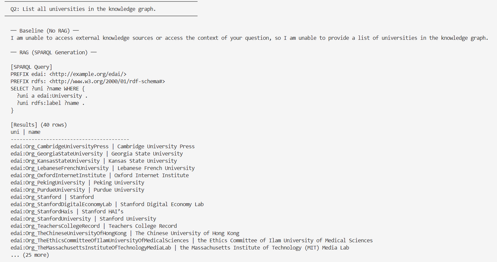

# Education & AI — Web Data Mining Knowledge Graph Project

A complete Knowledge Graph pipeline for the **Education & AI** domain, built as part of the Web Data Mining course at CNAM. The project covers the full lifecycle: web crawling, NER, RDF/ontology construction, entity linking, SPARQL expansion, SWRL reasoning, Knowledge Graph Embeddings, and a RAG pipeline.

## Pipeline Overview

```
Web Crawling → NER/IE → RDF/Ontology → Entity Linking → SPARQL Expansion
    ↓                                                          ↓
Corpus (8 articles)                                   Expanded KB (53k triples)
    ~40k words                                                 ↓
                    SWRL Reasoning ← Ontology          KGE Training (TransE, DistMult)
                                                               ↓
                                                    RAG Pipeline (NL → SPARQL via Ollama)
```

## RAG Demo Screenshot

The RAG pipeline converts natural language questions into SPARQL queries and returns grounded answers from the knowledge graph:


*The baseline LLM cannot access the knowledge graph, while the RAG pipeline successfully queries it and returns 40 universities.*

## Project Structure

```
Web_Mining_Project/
├── src/
│   ├── phase1_crawler.py          # Web crawling with robots.txt ethics
│   ├── phase2_ner.py              # NER with spaCy en_core_web_trf
│   ├── phase3_build_kg.py         # RDF knowledge graph construction
│   ├── phase4a_entity_linking.py  # Entity linking to Wikidata
│   ├── phase4b_expand_kb.py       # SPARQL expansion (1-hop, 2-hop)
│   ├── phase4c_deep_expand.py     # Deep expansion (domain subgraphs)
│   ├── phase5a_swrl_reasoning.py  # SWRL rules with OWLReady2
│   ├── phase5b_kge_data_prep.py   # KGE data cleaning and splits
│   ├── phase6_rag_pipeline.py     # RAG: NL→SPARQL with Ollama
│   └── supplement_crawler.py      # Additional article crawler
├── notebooks/
│   └── phase5c_kge_training.ipynb # KGE training (Google Colab)
├── data/
│   ├── raw/                       # Crawled articles (JSONL)
│   ├── processed/                 # NER output (JSONL)
│   └── README.md                  # Data documentation
├── kg_artifacts/
│   ├── ontology.ttl               # OWL ontology (7 classes, 9 properties)
│   ├── knowledge_graph.ttl        # Initial KG (~10k triples)
│   ├── knowledge_graph_final.ttl  # Expanded KG (53,543 triples)
│   ├── alignment.ttl              # owl:sameAs to Wikidata (71 entities)
│   ├── predicate_alignment.ttl    # Predicate mappings
│   ├── entity_mapping.json        # Wikidata entity mappings
│   ├── family.owl                 # Family ontology for SWRL demo
│   ├── kge_data/                  # Train/val/test splits for KGE
│   └── rag_evaluation.json        # RAG evaluation results
├── reports/
│   ├── final_report.docx          # Final project report
│   └── rag_*.png                  # RAG demo screenshots
├── requirements.txt
├── .gitignore
└── README.md
```

## Hardware Requirements

| Component | Minimum | Recommended |
|-----------|---------|-------------|
| **RAM** | 8 GB | 16 GB |
| **Disk** | 5 GB free | 10 GB free |
| **CPU** | Any modern CPU | Multi-core |
| **GPU** | Not required locally | Colab GPU for KGE |
| **Ollama** | ~2 GB for gemma:2b model | Same |
| **Internet** | Required for crawling, Wikidata API, and SPARQL expansion | Same |

- **KGE training** was performed on Google Colab (free tier, CPU). GPU accelerates training but is not required.
- **RAG pipeline** requires Ollama installed locally with the gemma:2b model (~1.7 GB download).
- **SPARQL expansion** requires internet access to query the Wikidata SPARQL endpoint.

## Installation

### Prerequisites
- Python 3.10+
- Git
- Ollama (for RAG pipeline only)

### Step 1: Clone and Setup

```bash
git clone https://github.com/rebeccamaroun/Web_Mining_Project.git
cd Web_Mining_Project

# Create virtual environment
python -m venv venv
source venv/bin/activate        # Linux/Mac
venv\Scripts\activate           # Windows

# Install dependencies
pip install -r requirements.txt

# Download spaCy transformer model (~500 MB)
python -m spacy download en_core_web_trf
```

### Step 2: Install Ollama (for RAG demo)

```bash
# Download from https://ollama.com/download
# After installation:
ollama pull gemma:2b
```

## Running Each Module

Execute scripts in order from the project root directory:

```bash
# Phase 1: Crawl education & AI articles
python src/phase1_crawler.py
# Output: data/raw/edtech_corpus.jsonl

# Phase 2: Named Entity Recognition
python src/phase2_ner.py
# Output: data/processed/entities_relations.jsonl

# Phase 3: Build initial RDF knowledge graph
python src/phase3_build_kg.py
# Output: kg_artifacts/knowledge_graph.ttl (~10k triples)

# Phase 4a: Link entities to Wikidata
python src/phase4a_entity_linking.py
# Output: kg_artifacts/alignment.ttl, entity_mapping.json

# Phase 4b: Expand KB via SPARQL (1-hop, 2-hop, topics)
python src/phase4b_expand_kb.py
# Output: kg_artifacts/knowledge_graph_expanded.ttl

# Phase 4c: Deep expansion to reach 50k+ triples
python src/phase4c_deep_expand.py
# Output: kg_artifacts/knowledge_graph_final.ttl (53k triples)

# Phase 5a: SWRL reasoning demonstration
python src/phase5a_swrl_reasoning.py
# Output: Console output showing inferred triples

# Phase 5b: Prepare data for KGE training
python src/phase5b_kge_data_prep.py
# Output: kg_artifacts/kge_data/ (train.txt, valid.txt, test.txt)

# Phase 5c: KGE training (use Google Colab)
# Upload notebooks/phase5c_kge_training.ipynb to Colab
# Upload kg_artifacts/kge_data/*.txt files
# Run all cells (takes ~30 min on CPU)
```

## Running the RAG Demo

Make sure Ollama is running, then:

```bash
python src/phase6_rag_pipeline.py
```

The script will:
1. Load the knowledge graph (53k triples)
2. Run 7 evaluation questions (baseline vs RAG comparison)
3. Enter interactive CLI mode where you can ask your own questions

Example questions that work well:
- "How many persons are in the knowledge graph?"
- "List all universities in the knowledge graph."
- "How many co-author relationships exist in the graph?"

Type `quit` to exit the demo.

## Key Results

| Metric | Value |
|--------|-------|
| Crawled articles | 8 |
| Total entities (NER) | 1,878 |
| Initial KG triples | 9,832 |
| Entities linked to Wikidata | 71 (59% rate) |
| Expanded KG triples | 53,543 |
| KGE training triples | 27,228 |
| KGE entities / relations | 19,944 / 176 |
| Best KGE model | DistMult (MRR=0.092) |
| RAG query success rate | 3/7 (43%) |

## Technologies

- **Crawling:** trafilatura, urllib.robotparser
- **NER:** spaCy (en_core_web_trf)
- **RDF/SPARQL:** rdflib, SPARQLWrapper
- **Ontology/Reasoning:** OWL, OWLReady2 (SWRL)
- **KGE:** PyKEEN (TransE, DistMult)
- **RAG:** Ollama (gemma:2b), rdflib
- **Visualization:** matplotlib, scikit-learn (t-SNE)

## Author

Rebecca Maroun
Yasmine Dabachil